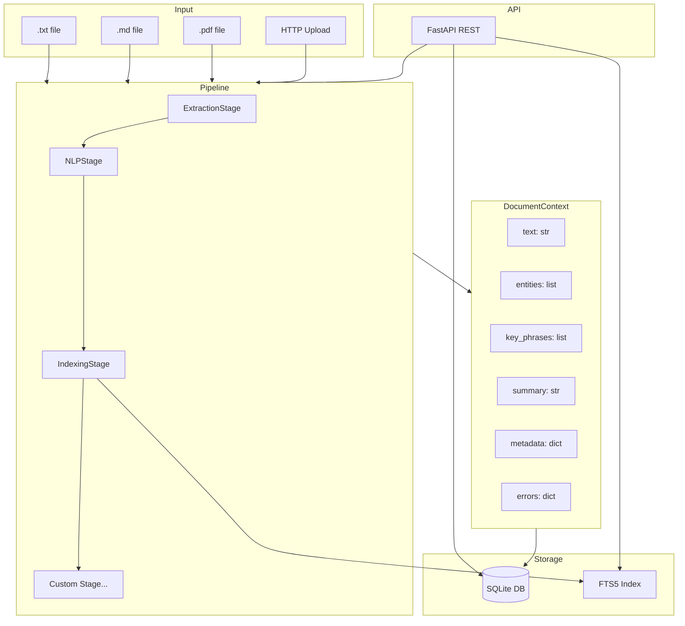
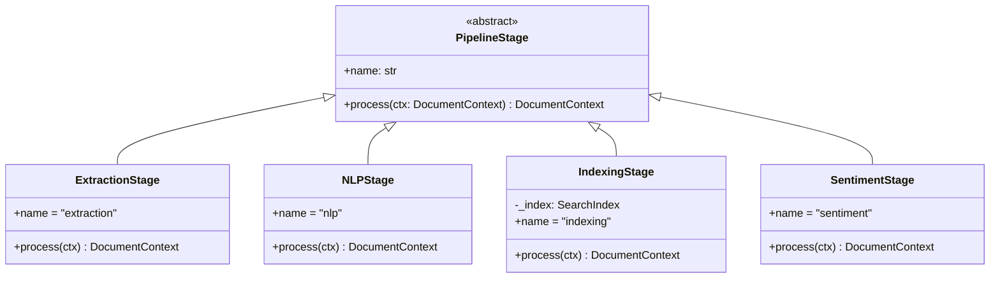

# Architecture: Document Processing Pipeline

## Overview

The document pipeline is built around a **Chain of Responsibility** pattern combined
with a **Plugin Architecture**. Documents flow through ordered stages, each adding
enrichment to a shared `DocumentContext`. Stages are isolated — one stage failure
cannot halt the pipeline.

## System Architecture



## Component Design

### Core Components

| Component | File | Responsibility |
|-----------|------|----------------|
| `DocumentContext` | `pipeline.py` | Shared mutable state passed through stages |
| `PipelineStage` | `pipeline.py` | ABC defining the stage interface |
| `Pipeline` | `pipeline.py` | Orchestrates stages, handles errors |
| `extract_text` | `extractors.py` | File I/O for .txt, .md, .pdf |
| `SearchIndex` | `search.py` | SQLite FTS5 full-text search |
| `database.py` | `database.py` | SQLite document persistence |
| `app.py` | `app.py` | FastAPI REST endpoints |

### Stage Architecture



## Key Design Decisions

### 1. Regex-Based NLP (No External ML Models)

**Decision**: Use regex patterns instead of spaCy, NLTK, or transformers.

**Rationale**:
- No model download required (spaCy models are 10-800MB)
- Zero external data dependencies for CI/CD
- Deterministic output for testing
- Sufficient accuracy for business document entity extraction (Corp/Inc suffixes,
  known locations, title patterns like CEO/CFO)
- O(n) complexity, linear in text length

**Trade-off**: Lower accuracy for ambiguous entities compared to ML models.
Acceptable given the benchmark scope.

### 2. SQLite FTS5 for Search

**Decision**: Use SQLite's built-in FTS5 virtual table for full-text search.

**Rationale**:
- Zero additional dependencies (SQLite is part of Python's stdlib)
- FTS5 provides BM25 ranking, phrase search, prefix search
- `snippet()` function generates highlighted excerpts
- Easily replaced with Elasticsearch/OpenSearch for production scale
- `:memory:` mode enables isolated testing without filesystem side effects

### 3. Isolated Stage Error Handling

**Decision**: Each stage's `process()` call is wrapped in try/except; errors are
recorded in `ctx.errors[stage_name]` rather than propagating.

**Rationale**:
- Partial results are more useful than no results for downstream consumers
- A PDF extraction failure should not prevent NLP on already-extracted text
- Errors are surfaced in the result dict for observability without crashing

### 4. Dataclass Context Object

**Decision**: `DocumentContext` is a `@dataclass` rather than a dict or TypedDict.

**Rationale**:
- Type safety: IDE and mypy know the shape at compile time
- Mutability: stages modify in-place without defensive copying
- Clarity: field names are self-documenting
- Default values eliminate null-checking boilerplate

### 5. Open/Closed Principle for Stages

**Decision**: New stages are added by subclassing `PipelineStage` and passing to
`pipeline.add_stage()`. No modification of existing stages required.

**Rationale**:
- `SentimentStage` demonstrates this: fully functional without touching any other file
- Enables plugin/extension patterns for third-party stage libraries
- Stages can be unit-tested in isolation

## Data Flow

```
File Path
  │
  ▼
DocumentContext(path=path, text="", entities=[], ...)
  │
  ▼ ExtractionStage
DocumentContext(text="...", word_count=N, reading_time=T)
  │
  ▼ NLPStage
DocumentContext(entities=[...], key_phrases=[...], summary="...")
  │
  ▼ IndexingStage
DocumentContext(metadata={..., "indexed": True, "search_doc_id": N})
  │
  ▼ Pipeline.process() → result dict
  │
  ├─→ database.save_document() → SQLite
  └─→ Return to caller
```

## API Design

The FastAPI layer is a thin adapter over the pipeline and storage:

- `POST /documents/` — writes temp file, runs pipeline, saves to DB
- `GET /documents/` — lists from SQLite
- `GET /documents/{id}` — single document from SQLite
- `DELETE /documents/{id}` — removes from SQLite
- `POST /search/` and `GET /search/` — delegates to SearchIndex
- `GET /documents/{id}/entities` — entity sub-resource from SQLite
- `GET /stats/` — aggregate statistics from SQLite

## Extension Points

To add a new stage:

```python
from doc_pipeline.pipeline import DocumentContext, PipelineStage

class ReadabilityStage(PipelineStage):
    @property
    def name(self) -> str:
        return "readability"

    def process(self, ctx: DocumentContext) -> DocumentContext:
        # Flesch-Kincaid score
        sentences = ctx.text.count('.') + ctx.text.count('!') + ctx.text.count('?')
        words = ctx.word_count
        if sentences > 0 and words > 0:
            score = 206.835 - 1.015 * (words / sentences)
            ctx.metadata["readability_score"] = round(score, 2)
        return ctx

# Usage
from doc_pipeline.pipeline import Pipeline
pipeline = Pipeline()
pipeline.add_stage(ReadabilityStage())
result = pipeline.process(path)
```
